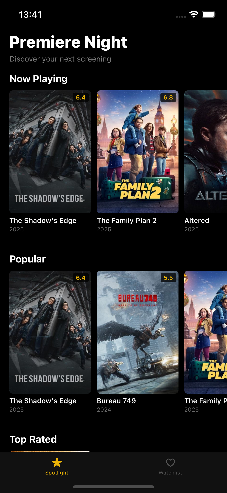

# Premiere Night

A simple movie discovery app built with React Native.\
Browse popular movies, check movie details, and add films to your
Watchlist.

This app uses the TMDb API along with React Navigation, Zustand, and
AsyncStorage.

------------------------------------------------------------------------

## Getting Started

### Prerequisites

-   Node 18+
-   React Native CLI
-   Xcode (for iOS)
-   Android Studio (for Android)
-   TMDb API Key

------------------------------------------------------------------------

## Demo GIF

You can add a GIF preview of the app by placing a file (e.g.,
`demo.gif`) inside the project and referencing it:

``` md

```

------------------------------------------------------------------------

## Adding Images / Screenshots

Place your screenshots inside a folder named **ScreenShots** and
reference them like:

``` md


```

------------------------------------------------------------------------

## Installation

``` sh
npm install
```

### iOS

``` sh
cd ios && pod install && cd ..
npm run ios
```

### Android

``` sh
npm run android
```

If Metro Bundler is not running (error: *No bundle URL present*):

``` sh
npm start
```

------------------------------------------------------------------------

## Project Structure

    src/
    ── api/          # TMDb API calls
    ── components/   # Reusable UI (MovieCard, etc.)
    ── navigation/   # React Navigation setup
    ── screens/      # Home, Detail, Watchlist
    ── state/        # Zustand store
    ── types/        # TypeScript definitions
    ScreenShots/     # Added screenshots of the app

------------------------------------------------------------------------

## Tech Stack

-   React Native 0.73
-   TypeScript
-   Zustand
-   React Navigation
-   AsyncStorage

------------------------------------------------------------------------

## Architecture Notes

-   Zustand selected for minimal, scalable global state management.
-   AsyncStorage used for persistent local watchlist storage.
-   TMDb API provides movie data with simple configuration.
-   React Navigation for clean separation between screens.
